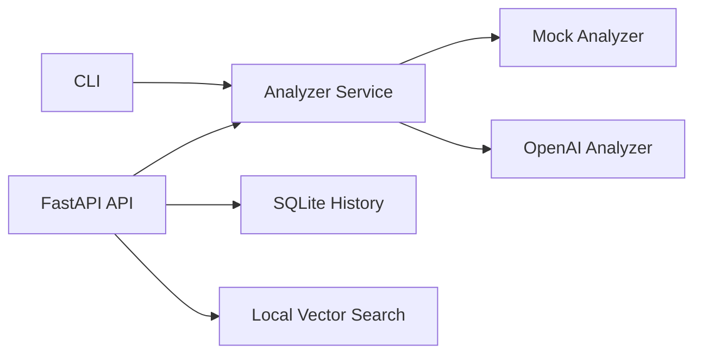

# AI Job Match Assistant

Portfolio project for moving from data engineering into AI engineering.

GitHub: https://github.com/krishna3791/ai-job-match-assistant

This project works without paid AI APIs by default. It compares a resume with a job description using a deterministic mock analyzer, while also including an OpenAI structured-output provider path for future LLM-powered analysis.

It returns:

- Match score
- Readiness level
- Resume and job skills detected
- Skills found in both resume and job description
- Skills missing from the resume
- Missing skills grouped by category
- Resume improvement suggestions
- Personalized learning plan

Current backend features:

- FastAPI backend
- SQLite storage
- Analysis history
- Local vector search over stored job descriptions
- LLM-ready provider abstraction
- OpenAI structured-output provider path
- Automated tests

## Architecture



## Quick Start

Create and activate a virtual environment:

```powershell
python -m venv .venv
.\.venv\Scripts\Activate.ps1
python -m pip install --upgrade pip
python -m pip install -r requirements.txt
```

If PowerShell blocks activation, run:

```powershell
Set-ExecutionPolicy -Scope Process -ExecutionPolicy Bypass
```

Run the text report:

```powershell
python scripts/analyze_match.py data/sample_resume.txt data/sample_job_description.txt
```

Run JSON output:

```powershell
python scripts/analyze_match.py data/sample_resume.txt data/sample_job_description.txt --format json
```

Run tests:

```powershell
python -m pytest
```

Run evaluation cases:

```powershell
python scripts/run_evaluations.py
```

Run the API server:

```powershell
python -m uvicorn app.api:app --reload
```

Then open:

```text
http://127.0.0.1:8000/docs
```

For the local web app, open:

```text
http://127.0.0.1:8000/
```

Useful API endpoints:

```text
GET /health
POST /analyze
GET /history
GET /history/{record_id}
POST /jobs
GET /jobs
POST /jobs/search
POST /resume/analyze
POST /resume/rewrite
```

Show safe configuration metadata:

```powershell
python scripts/analyze_match.py data/sample_resume.txt data/sample_job_description.txt --show-config
```

For local secrets, copy `.env.example` to `.env` and edit `.env`. Never commit real API keys.

If `python` is not available on Windows, install Python 3.11+ from https://www.python.org/downloads/windows/ and enable "Add python.exe to PATH" during installation.

## Project Structure

```text
ai-job-match-assistant/
  README.md
  .gitignore
  .env.example
  requirements.txt
  app/
    api.py
    __init__.py
    cli.py
    config.py
    database.py
    evaluation.py
    matcher.py
    repository.py
    resume_documents.py
    resume_rewriter.py
    schemas.py
    services.py
    static/
    vector_search.py
  data/
    sample_resume.txt
    sample_job_description.txt
  tests/
    test_api.py
    test_cli.py
    test_config.py
    test_evaluation.py
    test_jobs_api.py
    test_matcher.py
    test_repository.py
    test_resume_documents.py
    test_resume_rewriter.py
    test_resume_upload_api.py
    test_services.py
    test_vector_search.py
  scripts/
    analyze_match.py
    run_evaluations.py
```

## Resume Bullet Draft

Built a FastAPI-based AI Job Match Assistant that compares resumes against job descriptions, identifies skill gaps, generates match scores, stores analysis history in SQLite, supports local vector search over job descriptions, and includes a provider abstraction for mock and OpenAI structured-output analyzers.

## Career Packaging

- Architecture: `docs/ARCHITECTURE.md`
- Resume and LinkedIn content: `docs/RESUME_LINKEDIN.md`
- Interview guide: `docs/INTERVIEW_GUIDE.md`
