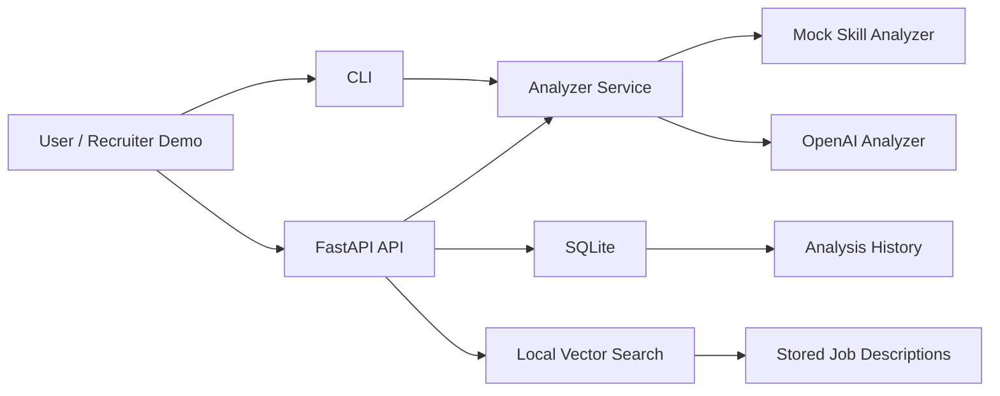

# Architecture

## Main Components

- `app/matcher.py`: deterministic skill matching baseline
- `app/services.py`: provider abstraction for mock and OpenAI analyzers
- `app/api.py`: FastAPI endpoints
- `app/database.py`: SQLite setup
- `app/repository.py`: persistence and job search operations
- `app/vector_search.py`: local embedding and similarity search
- `app/evaluation.py`: evaluation cases for expected behavior

## Why This Design Works For A Portfolio

The project shows backend engineering, AI application structure, testing, persistence, and retrieval without becoming too large to explain in interviews.
